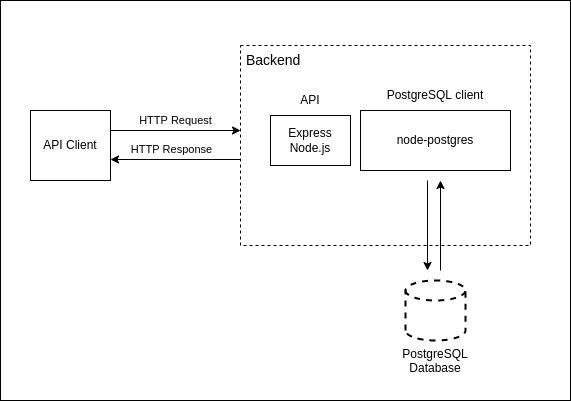

# Journal App Server

Journaling tool to save your notes/prompts and manage them separately.

[Client Repo](https://github.com/almeidavc/journal-app-client)

<!-- Overview + Technologies used -->

## Overview

Backend for the journaling app. Implemented an API to get, create, update and delete notes/prompts. Modelled drafts/prompts and their attributes as tables in a relational database system. Built with:

- Node.js as the runtime environment
- Express to build the REST API
- PostgreSQL as the relational database

<!-- Backend Architecture + API Endpoints -->

## Backend Architecture

## API Endpoints

| URI           | Method | Description                                 |
| ------------- | ------ | ------------------------------------------- |
| /prompts      | GET    | Read all prompts                            |
| /prompts/{id} | GET    | Read prompt                                 |
| /prompts      | POST   | Create a new prompt                         |
| /prompts/{id} | PUT    | Update prompt                               |
| /prompts/{id} | DELETE | Delete prompt                               |
| /drafts       | GET    | Read all drafts                             |
| /drafts-md    | GET    | Read all drafts metadata (without the body) |
| /drafts/{id}  | GET    | Read draft                                  |
| /drafts       | POST   | Create a new draft                          |
| /drafts/{id}  | PUT    | Update draft                                |
| /drafts/{id}  | DELETE | Delete draft                                |
